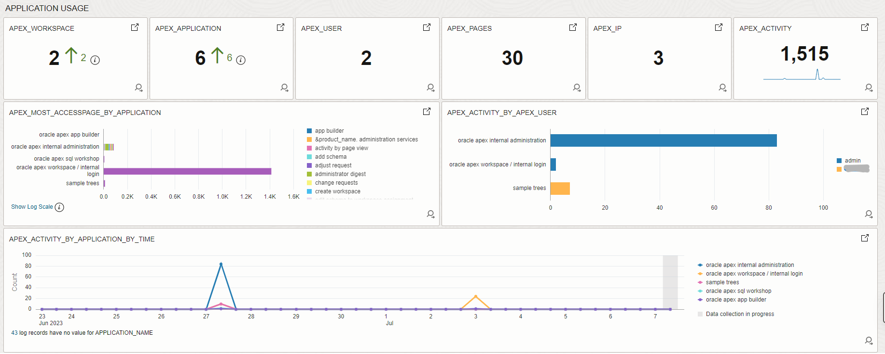
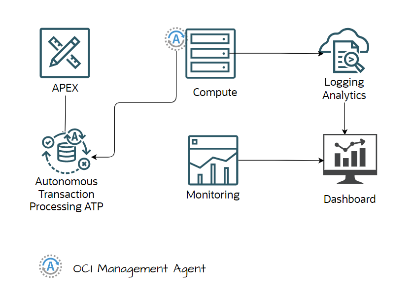

# Oracle APEX monitoring

*Asset Introduction*

Oracle APEX is an enterprise low-code application platform that enables developers to build scalable, secure web and mobile apps. It can run on-premises as well as OCI. 

Oracle APEX provides Administrator and monitoring Dashboards inside the framework. That requires specific APEX access and skills. 

OCI Observability offers a single point of control for all the services. In that way the admin doesn't have to access the specific services console, all the information will be on Dashboards and all will be accessible from the Observability and Management.

This project is about getting out the monitoring data from the Oracle APEX repository and publishing them on an OCI Dashboard. Once the OCI admin has the Oracle APEX data out they can cross and correlate application performances and resource utilization but also have Oracle APEX data in a single pane of glass together with the other asset.   

## When to use this asset?
 
You want to include APEX monitoring in a single pane of glass and build your checks and alerts instead of accessing APEX Console. 


The errors widget group provides a view of application errors and application users impact. 


The user Authentication widget group shows the application user and the database login. In this case, it provides the success and the failure logon trend. It is recommended to define an alert when the failure exceeds a threshold limit.



The application usage widget group provides an overview of the application workload in terms of workspace, application, pages and users.

Each widget allows to drill down. In the File Explorer, you can see there are three source


You can use these sources to build your widget <https://docs.oracle.com/en-us/iaas/Content/Dashboards/Tasks/widgetmanagement.htm>

## How to use this asset?



For the scope, I used an ATP Database but it can be implemented also on-premises database as well as a OCI Base Database.

APEX monitoring data are stored in the database where APEX runs. The OCI Management Agent connects to the database by SQL connection and queries the data. The results are transered in OCI Logging Analytics. Metrics from the database are by default stored in Monitoring. 


# Pre-requisites
- Database 
    - Pluggable Database (PDB), Multitenant  Container Database (CDB), and Application Container
    - Oracle Database Instance
    - Oracle Autonomous Database(ADW/ATP)
- OCI Logging Analytics enabled and accessible  https://docs.oracle.com/en/cloud/paas/logging-analytics/logqs/#before_you_begin


# Installation instructions

1. Policies and Compartment 
- Create a compartment like APEX and copy the OCID. 
- Create a dynamic group Mng_Agent where the Management Agent will be part of

```json
All {resource.type = 'managementagent', resource.compartment.id = 'Compartment_OCID'}
```

- Create the following policies

```json
allow dynamic-group Mng_Agent to MANAGE management-agents IN compartment APEX
allow dynamic-group Mng_Agent to USE METRICS IN compartment APEX
allow dynamic-group Mng_Agent to {LOG_ANALYTICS_LOG_GROUP_UPLOAD_LOGS} IN compartment APEX`
```

2. Create the OCI Linux Compute

Create an OCI Compute in the same compartment you created in the former step. Once the Compute has been created go to Cloud Agent tab and enable the Management Agent. 


Go on Observability and Management and check in the Agent section the new agent (specify the right compartment, for example, APEX)

Enable the Logging Analytics Plugin in the agent


3. Create the connection between Logging Analytics and the APEX DB

Create the Entity DBNAME in Logging Analytics from the OCI Console 


Download the ATP Wallet on the Compute VM


From the Compute VM create a json file APEXcred.json

```json
{
   "source": "lacollector.la_database_sql",
   "name": "LCAgentDBCreds.<Database_Entity_Name>",
   "type": "DBTCPSCreds",
   "usage": "LOGANALYTICS",
   "disabled": "false",
   "properties":[
         {"name":"DBUserName","value":"<Database_User_Name>"},
         {"name":"DBPassword","value":"<Database_Password>"},
         {"name":"ssl_trustStoreType","value":"JKS"},
         {"name":"ssl_trustStoreLocation","value":"<SSL_Truststore_Location>"},
         {"name":"ssl_trustStorePassword","value":"<SSL_Truststore_Password>"},
         {"name":"ssl_keyStoreType","value":"JKS"},
         {"name":"ssl_keyStoreLocation","value":"<SSL_Keystore_Location>"},
         {"name":"ssl_keyStorePassword","value":"<SSL_Keystore_Password>"},
         {"name":"ssl_server_cert_dn","value":"yes"}]
}
```

run this command to register it

```console
cat APEXcred.json | sh /var/lib/oracle-cloud-agent/plugins/oci-managementagent/polaris/agent_inst/bin/credential_mgmt.sh -o upsertCredentials -s logan
 -o upsertCredentials -s logan
```

For detailed steps please refer to https://docs.oracle.com/en/cloud/paas/logging-analytics/tutorial-atp-adw-support/#before_you_begin

4. Create the Dashboard 

Download the zip and the json file from project dashboards and log-sources folder

Import the Sources definition

From OCI Console -> Observability and Management -> Logging analytics -> Administration Overview -> Import Configuration Content 


Select one by one all the zip files 

For each Source APEX_ created, associate the Source with the ATP Entity

From OCI Console -> Observability and Management -> Logging analytics -> Administration Overview -> Source and for each source click "Unassociated Entity" and select the DBName  


Import the Dashboard 

From OCI Console -> Observability and Management -> Logging analytics -> Dashboard -> Import and select the dashboard JSON 


## Useful Links (Optional)
 
- [OCI Observability ](https://www.oracle.com/manageability/)
- [OCI Logging Analytics ](https://docs.oracle.com/en-us/iaas/logging-analytics/index.html)
- [OCI APEX ](https://apex.oracle.com/en/platform/apex-oracle-cloud/)


# License

Copyright (c) 2023 Oracle and/or its affiliates.

Licensed under the Universal Permissive License (UPL), Version 1.0.

See [LICENSE](https://github.com/oracle-devrel/technology-engineering/blob/folder-structure/LICENSE) for more details.